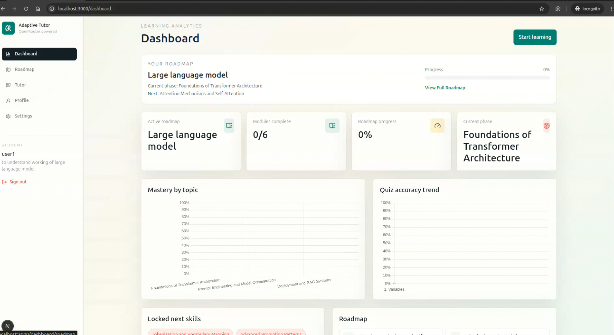
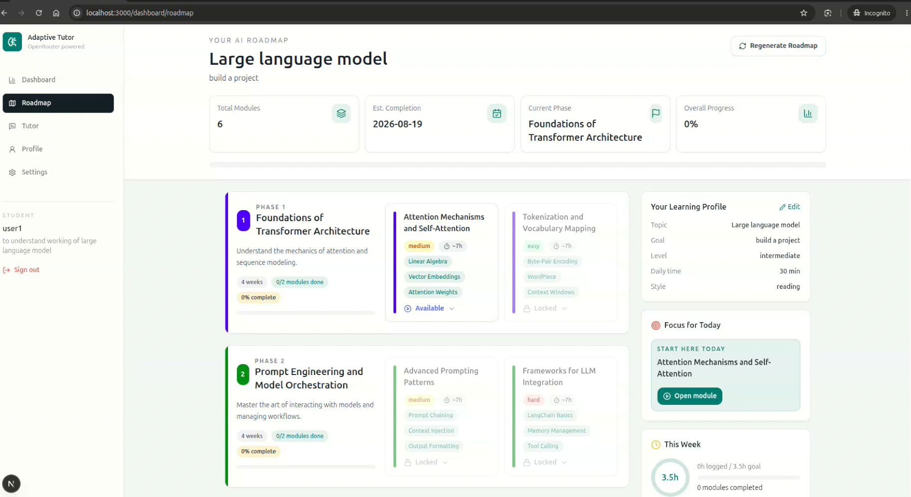
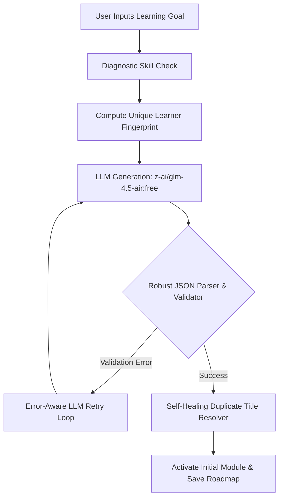

# Adaptive AI Personal Tutor 🧠✨

A production-shaped, multi-agent AI tutor prototype designed to deliver personalized, adaptive learning experiences. Built with a **FastAPI** backend and a **Next.js App Router** frontend, this project orchestrates multiple specialized AI agent roles to assess, teach, quiz, and track concept mastery for learners.

---

## 📺 Project Demo Video
Watch the interactive walkthrough of the onboarding, diagnostic assessment, personalized roadmap generation, and Socratic tutoring loop:

<video src="./media/roadmap_generator_demo.mp4" controls width="100%"></video>

---

## 📸 Screenshots

### 1. Concept Mastery Dashboard
Track your daily learning analytics, overall concept mastery percentage, weak prerequisite topics, and current progress milestones.


### 2. Personal Learning Roadmap
Visualized personalized learning roadmap sequenced dynamically according to the learner's skill check performance.


---

## 🗺️ How the Roadmap Generation Works

The core of the personalization engine is the **Adaptive Roadmap Generator**. When a learner specifies a learning goal, the tutor goes through the following multi-stage pipeline:



### 1. User Profiling & Uniqueness Fingerprint
A unique SHA-256 fingerprint is calculated from the learner's profile, including:
- Learning goals, target subject, and self-assessed level
- AI-assessed level (from the onboarding diagnostic check)
- Learning style preference (e.g., example-first, visual, Socratic)
- Target deadlines and daily study time commitment

This fingerprint forces the LLM to vary phase emphasis, module ordering, practice projects, examples, and resources, ensuring that **no two users get the exact same roadmap**, even for the same topic.

### 2. Multi-Agent Orchestration Loop
The tutor orchestration engine (`backend/app/agents.py`) runs several specialized agent nodes:
- **Planner Agent**: Schedules milestones, goals, and structures module dependencies.
- **Teacher Agent**: Adapts lesson styling and builds interactive code examples.
- **Socratic Coach**: Asks deep conceptual questions to surface student misconceptions.
- **Quiz Agent**: Generates adaptive multiple-choice quizzes mapping to the user's mastery level.
- **Knowledge-Gap Detector**: Identifies missing prerequisites and flags weak topics for review.
- **Memory Agent**: Persists logs, key mistakes, and preferences.
- **Dashboard Agent**: Syncs metrics and compiles analytics for Next.js.

### 3. Robust Validation & Self-Healing
To guarantee stability, the generated roadmap undergoes strict JSON validation. If errors occur, the backend handles them gracefully:
* **Conciseness Enforcement**: Constrains the LLM to 3-4 phases and 2-4 modules per phase, with 1-2 sentence descriptions, preventing token truncation.
* **Escaping Guardrails**: Prevents unescaped double quotes syntax errors in JSON keys/values.
* **Self-Healing Duplicates**: If duplicate module or resource titles are generated, they are dynamically made unique (e.g. appending numeric suffixes or parent module names) instead of raising exceptions.
* **Detailed Error Retries**: The retry loop catches exact validation error exceptions and feeds them back into the LLM on subsequent attempts for immediate self-correction.

---

## 🛠️ Tech Stack

- **Backend**: FastAPI, Python 3.10+, SQLite (local DB metadata), Uvicorn.
- **Frontend**: Next.js (App Router), React 18, TailwindCSS, Zustand (State Management), Chart.js (Analytics), Lucide-React (Icons).
- **LLM Engine**: OpenRouter Integration (defaulting to `z-ai/glm-4.5-air:free` or configurable via environment variables).

---

## 🚀 Quick Start

### Prerequisites
- Python 3.10+ installed
- Node.js 18+ installed

### 1. Backend Setup
1. Navigate to the backend directory:
   ```bash
   cd backend
   ```
2. Create and activate a python virtual environment:
   ```bash
   python3 -m venv .venv
   source .venv/bin/activate
   ```
3. Install dependencies:
   ```bash
   pip install -r requirements.txt
   ```
4. Start the FastAPI server:
   ```bash
   uvicorn app.main:app --reload --port 8000
   ```
   *The backend will run on `http://localhost:8000` and initialize a local SQLite file `tutor.db`.*

### 2. Frontend Setup
1. Navigate to the frontend directory:
   ```bash
   cd frontend
   ```
2. Install package dependencies:
   ```bash
   npm install
   ```
3. Start the Next.js development server:
   ```bash
   npm run dev
   ```
   *Open `http://localhost:3000` to view the application in your browser.*

---

## ⚙️ Environment Configuration

### Backend Environment (`backend/.env` or root `.env`)
Create a `.env` file in the root or backend directory:
```env
JWT_SECRET=your-secure-jwt-key
OPENROUTER_API_KEY=your-openrouter-api-key
OPENROUTER_MODEL=z-ai/glm-4.5-air:free
ACCESS_TOKEN_EXPIRE_MINUTES=30
REFRESH_TOKEN_EXPIRE_DAYS=14
```

### Frontend Environment (`frontend/.env` or root `.env`)
Create a `.env` file in the frontend directory:
```env
NEXT_PUBLIC_API_URL=http://localhost:8000
```

---

## 🐳 Docker Deployment

To spin up the entire stack (Frontend, Backend, and local services) inside Docker containers:
```bash
docker compose up --build
```
This runs the frontend, backend, and sets up dependencies.
